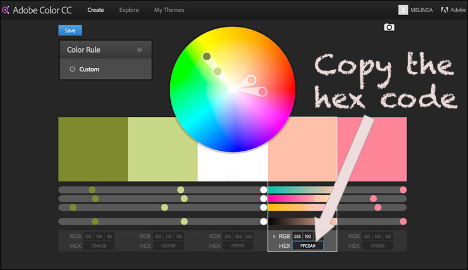
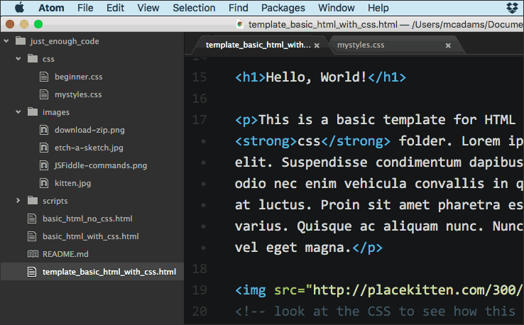
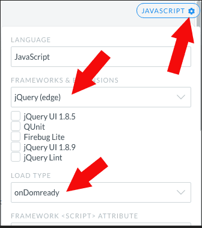

# Just Enough Code

Teaching web design in 2016 shouldn't be about software and which buttons to push. This 20-minute segment was part of a pre-conference workshop from the Visual Communication Division of [AEJMC](http://www.aejmc.org/).

In my view, code is empowering. Using code is like using brushes and paint, and using software tools is like using an Etch A Sketch.


*Don't teach your students to use this.*

**A WORD OF WARNING:** HTML, CSS, and JavaScript have all evolved over the years. When you search online for answers, tutorials, and examples, check *carefully* to find a date, and make sure you are not using old techniques that have been replaced. Outdated info is a big source of trouble for beginners!

## Step 1: HTML

Use [JSFiddle](https://jsfiddle.net/) to let students play with HTML tags. Students can create a free account, save their work, and turn in a JSFiddle URL for a grade. [Here is an example.](https://jsfiddle.net/macloo/3j60uz7b/) Use the example by changing things, adding things, moving things. Learn code by playing with code!

The key commands in JSFiddle are Run, Save and Update, and Set as Base.


First, focus on learning to use headings, paragraphs, images, and links (as in the example). Emphasize that HTML is intended to reflect the document's structure. For example, use an `h1` tag *only* for the top-level heading in the document, and do not use `h` tags (`h1` through `h6`) on any text that is *not a heading*. The tags are not meant to make text *look* a certain way; they are meant to mark up the structural elements.

```
<h1> </h1>
<p> </p>

<a href=""> </a>
```

Note that all images must have an `alt` attribute, or the HTML will not [validate](https://html5.validator.nu/). If you don't believe me, [read this](https://www.joedolson.com/2015/03/are-alt-attributes-required-always/).

Another thing to note is that today, no tags require a slash at the end — `/>` — that was XHTML, and it's gone. All modern browsers support HTML5 now. Tags are either paired — `<p> </p>` — or empty — ``. Paired tags typically have text between them.

The `<br>` tag is not intended for creating linespaces. [Its few legitimate uses](https://developer.mozilla.org/en-US/docs/Web/HTML/Element/br) include postal addresses and poetry.

```
<p>Mary McFee<br>
123 Main Street<br>
Littletown, FL 32611</p>

<p>A fly and a flea in a flue<br>
Were imprisoned, so what could they do?<br>
Said the fly: "Let us flee!"<br>
"Let us fly!" said the flea.<br>
So they flew through a flaw in the flue.</p>
```

If you want to introduce bold and italic styles, use the `<strong>` and `<em>` tags, not the old `<b>` and `<i>` tags!

Above all, do not let students insert style elements such as fonts and colors into the HTML tags. That is not how it's done in 2016.

After headings, paragraphs, images, and links, students should learn to use the three types of lists: ordered, unordered, and definition ([see example file, lines 51–73](https://github.com/macloo/just_enough_code/blob/master/basic_html_no_css.html)). Save forms and tables for *much* later. Also, we'll get to `html`, `head`, and `body` in step 3, below.

### Reliable HTML resources:

* [HTMLDog tutorials: HTML](http://htmldog.com/guides/html/beginner/)
* [Codecademy HTML & CSS](https://www.codecademy.com/learn/web)

## Step 2: CSS

Still using JSFiddle, you can introduce hexadecimal colors — see [video](https://www.youtube.com/watch?v=iJcIlC4yFIQ&index=22&list=PLZFU-W6LLeecJuSQh20QUU_gCmS30sLTB) (4 min.). In CSS, the `background` property determines the background color of an element, and the `color` property determines the foreground or text color.

Color will always be separated from the HTML. JSFiddle makes it easy to do this from the very start. [Here is an example.](https://jsfiddle.net/macloo/79fkd75m/)

```
body {
  background: #E2F0D6;
}
h1 {
  background: #95AB63;
  color: #F6FFE0;
}
```

Students like using the [Adobe Color site](https://color.adobe.com/) for experimenting with color palettes. They can easily copy hexadecimal codes from there.



* [Video about using Adobe Color](https://www.youtube.com/watch?v=Um7TVYF0QIU&list=PLZFU-W6LLeecJuSQh20QUU_gCmS30sLTB&index=21) (4 min. 24 sec.)
* [Video about the hexadecimal color codes](https://www.youtube.com/watch?v=iJcIlC4yFIQ&list=PLZFU-W6LLeecJuSQh20QUU_gCmS30sLTB&index=22) (4 min.)

Along with colors, you can introduce link styles (pseudo classes). This is a simple way to start that reinforces working with hexadecimal colors and the background and color properties:
```
a {
    color: #95AB63;
}
a:hover {
    color: #F6FFE0;
    background: #152C73;
    text-decoration: none;
}
```

**What that does:** The first selector, `a`, affects all the uses of the `a` tag on the page. In this case, the block for `a` changes the text color to green. The second selector, `a:hover`, affects all links on the page when they are moused over. In this case, the block for `a:hover` contains three declarations that: (1) change the text color to yellow; (2) change the background color to dark blue; and (3) remove the underline from the link text.

After students have some experience with colors and CSS, you can introduce padding, margins, borders, and the [CSS box model](https://developer.mozilla.org/en-US/docs/Web/CSS/CSS_Box_Model/Introduction_to_the_CSS_box_model). (Do not get into DIVs, HTML5 elements, or positioning until students have experimented with padding, margins, and borders.)

Using borders is a great way to learn the different effects of margins and padding. [Here is an example.](https://jsfiddle.net/macloo/ux4kLdLg/) Note that every `p` element has a red border, and the left margin is 50 pixels. The `h1` element has no border and no margins, but it has 20 pixels of padding on all four sides.

I recommend saving fonts until later, when the students are working with real files and not JSFiddle.

### Using `div`

The HTML `div` tag is like duct tape — it has thousands of uses. When you wrap HTML in a pair of `div` tags, you can use CSS (and JavaScript) to do all kinds of things to that wrapped block. To target a specific `div` with CSS, we must give it a unique `id` in the HTML. [Here is an example.](https://jsfiddle.net/macloo/hxjn97u5/) Play with it!

### Reliable CSS resources:

* [HTMLDog tutorials: CSS](http://htmldog.com/guides/css/beginner/)
* [Codecademy HTML & CSS](https://www.codecademy.com/learn/web)

## Step 3: Using a Text Editor and Managing Files

There is more about code, I promise, but first we need to talk about text editors for Windows and Mac. You need to use a proper text editor for code, and you **must not use** Notepad (Windows) or TextEdit (Mac) because they don't do the right things in the right way.



[Atom](https://atom.io/) is my top recommendation for everyone.  [Notepad++](https://notepad-plus-plus.org/) will work for any Windows version (in case for some reason Atom does not work for you). Both are free.

At this point, your students can download a zipped copy of [this GitHub repo](https://github.com/macloo/just_enough_code): Click the **Clone or download** button and then click **Download ZIP**. This gives them a proper file structure for a project (with separate folders for *css, images,* and *scripts*) and a few file templates to work with.


**NOTE:** You don't need to use GitHub for anything other than this download. However, learning GitHub and teaching students to use it — in conjunction with the free [GitHub app](https://desktop.github.com/) — is incredibly great for teaching beyond the basics. Also: [GitHub Pages](https://pages.github.com/) let you publish websites for free!

### Use the example files

* [HTML file](https://github.com/macloo/just_enough_code/blob/master/basic_html_with_css.html)
* [CSS file](https://github.com/macloo/just_enough_code/blob/master/css/beginner.css)
* [Live page](http://macloo.github.io/just_enough_code/basic_html_with_css.html)

As you'll see, the live page is not pretty! A possible exercise is to improve the page by editing the CSS file. The HTML and CSS files are intended to be changed, by you or by anyone, for learning.

### Good work habits

It's important to start with good work habits for files. A few tips:

1. Always create a new folder for a new code project.
2. Inside that folder, create three separate folders for *css, images,* and *scripts*.
3. Save files into their proper folders.
4. Use relative URLs for images and for links within the project, because this makes the project portable. When the complete folder is uploaded to a web server, everything will work just as it does on the local hard drive. Relative URLs and links are explained [in this video](https://www.youtube.com/watch?v=K9NVYCego_4&list=PLZFU-W6LLeecJuSQh20QUU_gCmS30sLTB&index=13).

### Document structure

The basic, correct, standard structure for an HTML document in 2016 is this:

```
<!DOCTYPE html>
<html>
    <head>
        <!-- meta tags, title, link tags -->
    </head>

    <body>
        <!-- all content visible to users goes here -->
    </body>
</html>
```

The contents of the `head` section *and their order* are quite important. The minimum inside the `head` is as follows:

```
<head>
    <meta charset="utf-8">
    <meta name="viewport" content="width=device-width, initial-scale=1">
    <title> write a good title for search engines </title>
</head>
```

If stylesheets are linked, the `link` tag goes inside the `head` and below the `title`.

The *meta charset* tag is explained well [here](https://developer.mozilla.org/en-US/docs/Web/Guide/HTML/HTML5/Introduction_to_HTML5).

Here is a good [explanation](https://developer.mozilla.org/en-US/docs/Mozilla/Mobile/Viewport_meta_tag) of the *viewport meta tag.*

### Relevance of step 3

In this outline, I recommend a learning order that corresponds to a progression of expertise in a newsroom or other editing/production environment. The basic level of knowledge is HTML (step 1) and the ability to write (or fix) links, images, etc.

A little more advanced is the ability to write (or fix) specific CSS styles, such as colors, font sizes, and margins (step 2). Steps 1 and 2 apply to working within content management systems as well as outside them.

Step 3 goes beyond content management systems (such as WordPress) and enables  students to create complete standalone documents outside a content management system. Being able to use a text editor and manage files means they can create a site consisting of many pages, or a single-page application for web or mobile, or both.

At this point, students can begin learning about:

* Page layouts and responsive design/design for mobile devices
* Responsive images
* Optimizing image file size for best performance
* [Accessibility](https://www.w3.org/standards/webdesign/accessibility) for disabilities

## Step 4: JavaScript and jQuery

Thanks to [JSFiddle](https://jsfiddle.net/), which was introduced above, students can experiment very quickly with JavaScript and jQuery. It helps to understand the basics of HTML and CSS first.

Why teach JavaScript and jQuery to beginners? Because JavaScript is what makes digital content *interactive.* If you want it to move, spin, fold, animate, calculate, or just plain respond, then it needs JavaScript!

[jQuery](http://jquery.com/) is a JavaScript library, and JSFiddle makes it easy to start using it. In JSFiddle, open the menu in the JavaScript pane (shown below), change the two fields indicated, and you're ready to play.



I like to start students with something they can alter. Again, JSFiddle is perfect for this. [Here is an example.](https://jsfiddle.net/macloo/xegj2oe7/)

### The jQuery example

In that example, here are the important parts of the HTML:

```
<label>Subject</label>
<input type="text" id="subject" value="The rain">
<label>Verb</label>
<input type="text" id="verb" value="falls">
<label>Object</label>
<input type="text" id="object" value="on the plains">

<p id="sentence">
    Something new will appear here soon.
</p>
```

* `<label>` is an HTML tag used in conjunction with form fields. It contains text. This is not relevant to our JavaScript at all. We did not mention this tag until now, and I've put it into the HTML because using this tag is the standard way to label a form field.
* `<input type="text">` creates a form field into which we can type. You might call it a "text entry field." We can optionally give it a unique `id`. If we do not give it an optional `value`, it will be blank. (This is another HTML tag that we have not mentioned before.)
* `<p id="sentence">` is a normal `p` tag with an optional unique `id` added. This is the standard way to designate a unique identifier for any HTML element.

The `id` is usually **the key to manipulating things with JavaScript.** If something in your HTML has an `id`, you can address it and do things to it with a script. It's *vital* that each `id` is unique on the page. If it's not, the script will not work properly because it will be looking at more than one thing when it expects only one!

Take a moment to play with the live example in JSFiddle. Inside the lower right pane, change the text several times and watch what happens as a result.

Now look at the JavaScript/jQuery code:

```
// when subject value changes, change the text
$('#subject').change(function() {
    s = ($('#subject').val());
	v = ($('#verb').val());
	o = ($('#object').val());
    $('#sentence').text(s + " " + v + " " + o);
});
```

There are two more chunks of code that are nearly identical to that one. See if you can find the one-word difference in each chunk.

If you discovered that the difference is `$('#subject').` and `$('#verb').` and `$('#object').` in the second line (the first line is a *comment*) — congratulations!

What do those three things refer to? They refer to the unique `id` attributes **in the HTML.** Each `id` is in an `input` tag. Each chunk of script is "listening" to a specific `input` element — the one with the matching `id`. Listening — for what? For a *change* in the element. If you change the text and then Tab or Return, the script for that text-input goes into action.

What is the action that ensues? It takes place in four parts, one part per line of script. This is what each line does:

1. Puts the *value* of the text-input with `id` "subject" into a *variable,* s.
2. Puts the *value* of the text-input with `id` "verb" into a *variable,* v.
3. Puts the *value* of the text-input with `id` "object" into a *variable,* o.
4. Creates a *string* from s, v, and o by adding (actually, *concatenating*) them together with single spaces: `(s + " " + v + " " + o)`. Finds the element in the HTML with `id` "sentence" — because of `$('#sentence')`. Then *replaces* the text inside that element (the `p`) with the new string — because of `.text()`.

Right now you might be wondering how you would ever learn all those bits and pieces and how to put them together. Most people learn by looking at fairly simple scripts, playing with them, and modifying them. You don't need to know *everything* to be able to do *something.*

**NOTE:** This script is far from perfect. Its worst flaw is redundancy. Using JSFiddle, you and your students can try to improve this script.

### The pattern for changing things

The use of `id` attributes **in the HTML,** combined with a standard pattern in jQuery, makes possible quite a lot of things:

```
$('#some_id').some_action(function() {
    // code that makes things happen
    // can be several lines, or one
});
```

This document does not cover the use of `id` and `class` in detail. The core difference between them is that an `id` **must be unique** in a document, and `class` can be reused as many times as needed. Thus we can assign one `class` to several headings and paragraphs on a page and give all of them a bright yellow background, like highlighting, using CSS. We can use jQuery to manipulate both `id` and `class`.

### More examples

The JavaScript/jQuery scripts in [these examples](https://github.com/macloo/jQuery_useful) are heavily commented so that beginners can learn from them.

See my [public Fiddles](https://jsfiddle.net/user/macloo/fiddles/) for more examples. Some of the best/easiest ones:

* [animate 1](https://jsfiddle.net/macloo/n7wxbqch/)
* [animate 2](https://jsfiddle.net/macloo/bdLgwrwq/)
* [show and hide](https://jsfiddle.net/macloo/Lvs6y8jp/)
* [simple accordion menu](https://jsfiddle.net/macloo/nws97853/)
* [sliding sections](https://jsfiddle.net/macloo/bmLf12nd/)
* [toggle class](https://jsfiddle.net/macloo/7hfvgcLt/)
* [swap images](https://jsfiddle.net/macloo/3qr2jd8t/)

### Reliable JavaScript and jQuery resources:

* [Mozilla Developer Network: JavaScript](https://developer.mozilla.org/en-US/docs/Web/JavaScript)
* [Codecademy: JavaScript](https://www.codecademy.com/learn/javascript)
* [Codecademy: jQuery](https://www.codecademy.com/learn/jquery)
* [Code School: jQuery](https://www.codeschool.com/courses/try-jquery)
