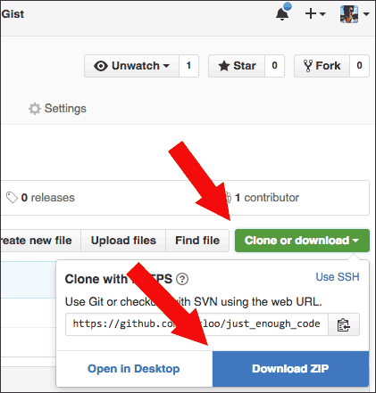

# Just Enough Code

Teaching web design in 2016 shouldn't be about software and which buttons to push. This 20-minute segment was part of a pre-conference workshop from the Visual Communication Division of [AEJMC](http://www.aejmc.org/).

In my view, code is empowering. Using code is like using brushes and paint, and using software tools is like using an Etch A Sketch.


*Don't teach your students to use this.*

## Step 1: HTML

Use [JSFiddle](https://jsfiddle.net/) to let students play with HTML tags. Students can create a free account, save their work, and turn in a JSFiddle URL for a grade. [Here is an example.](https://jsfiddle.net/macloo/3j60uz7b/) The key commands in JSFiddle are Run, Save and Update, and Set as Base.


First, focus on headings, paragraphs, images, and links (as in the example). Emphasize that HTML is intended to reflect the document's structure. For example, use an `h1` tag *only* for the top-level heading in the document, and do not use `h` tags (`h1` through `h6`) on any text that is *not a heading*. The tags are not meant to make text *look* a certain way; they are meant to mark up the structural elements.
```
<h1> </h1>
<p> </p>

<a href=""> </a>
```
Note that all images must have an `alt` attribute, or the HTML will not [validate](https://html5.validator.nu/). If you don't believe me, [read this](https://www.joedolson.com/2015/03/are-alt-attributes-required-always/).

Another thing to note is that no tags require a slash at the end — `/>` — that was XHTML, and it's gone. All modern browsers support HTML5 now. Tags are either paired — `<p> </p>` — or empty — ``.

If you want to introduce bold and italic styles, use the `<strong>` and `<em>` tags, not the old `<b>` and `<i>` tags!

Above all, do not let students insert style elements such as fonts and colors into the HTML tags. That is not how it's done in 2016.

After headings, paragraphs, images, and links, students should learn to use the three types of lists: ordered, unordered, and definition. Save forms and tables for *much* later. Also, we'll get to `html`, `head`, and `body` in step 3, below.

### Reliable HTML resources:

* [HTMLDog tutorials: HTML](http://htmldog.com/guides/html/beginner/)
* [Codecademy HTML](https://www.codecademy.com/learn/web)

## Step 2: CSS

Still using JSFiddle, you can introduce hexadecimal colors — see [video](https://www.youtube.com/watch?v=iJcIlC4yFIQ&index=22&list=PLZFU-W6LLeecJuSQh20QUU_gCmS30sLTB) (4 min.). In CSS, the `background` property determines the background color of an element, and the `color` property determines the foreground or text color.

Color will always be separated from the HTML. JSFiddle makes it easy to do this from the very start. [Here is an example.](https://jsfiddle.net/macloo/79fkd75m/)
```
body {
  background: #E2F0D6;
}
h1 {
  background: #95AB63;
  color: #F6FFE0;
}
```
Students like using the [Adobe Color site](https://color.adobe.com/) for experimenting with color palettes.

Along with colors, you can introduce link styles (pseudo classes). This is a simple way to start that reinforces working with hexadecimal colors and the background and color properties:
```
a {
    color: #95AB63;
}
a:hover {
    color: #F6FFE0;
    background: #152C73;
    text-decoration: none;
}
```
After students have some experience with colors and CSS, you can introduce padding, margins, borders, and the [CSS box model](https://developer.mozilla.org/en-US/docs/Web/CSS/CSS_Box_Model/Introduction_to_the_CSS_box_model). (Do not get into DIVs, HTML5 elements, or positioning until students have experimented with padding, margins, and borders.)

Using borders is a great way to learn the different effects of margins and padding. [Here is an example.](https://jsfiddle.net/macloo/ux4kLdLg/) Note that every `p` element has a red border, and the left margin is 50 pixels. The `h1` element has no border and no margins, but it has 20 pixels of padding on all four sides.

I recommend saving fonts until later, when the students are working with real files and not JSFiddle.

### Reliable CSS resources:

* [HTMLDog tutorials: CSS](http://htmldog.com/guides/css/beginner/)
* [Codecademy HTML](https://www.codecademy.com/learn/web)

### Step 3: Using a Text Editor and Managing Files

There is more about code, I promise, but first we need to talk about text editors for Windows and Mac. You need to use a proper text editor for code, and you **must not use** Notepad (Windows) or TextEdit (Mac) because they don't do the right things in the right way.

[Atom](https://atom.io/) is my top recommendation for everyone — except it looks like Windows 10 users can't use it (yet?). [Notepad++](https://notepad-plus-plus.org/) will work for any Windows version. Both are free.



Your students can now download a zipped copy of [this GitHub repo](https://github.com/macloo/just_enough_code): Click the **Clone or download** button and then click **Download ZIP**. This gives them a proper file structure for a project (with separate folders for *css, images,* and *scripts*) and a few file templates to work with.

### Step 4: JavaScript and jQuery
